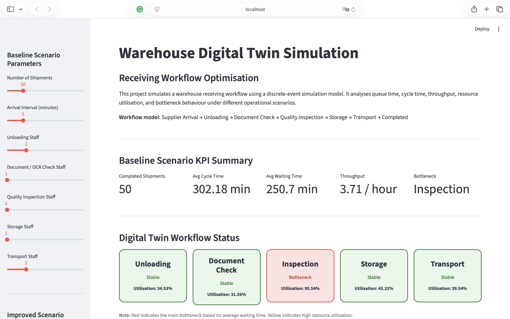
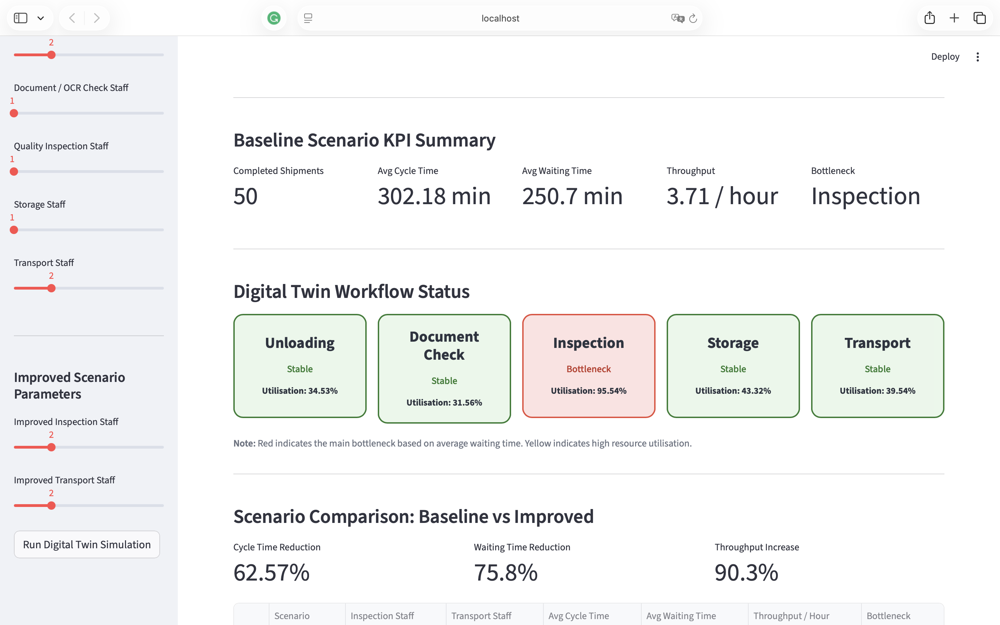
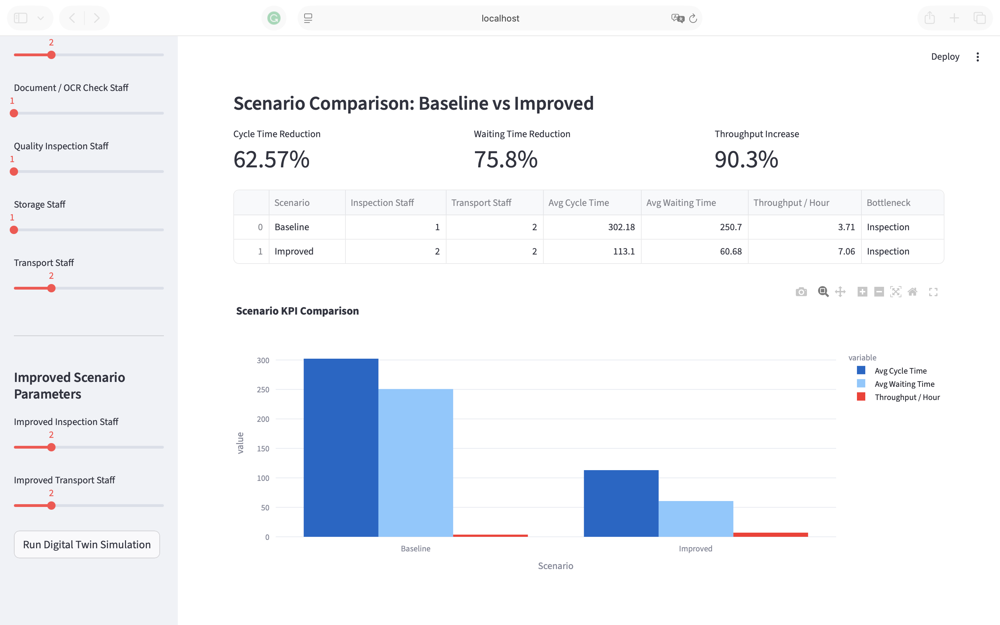
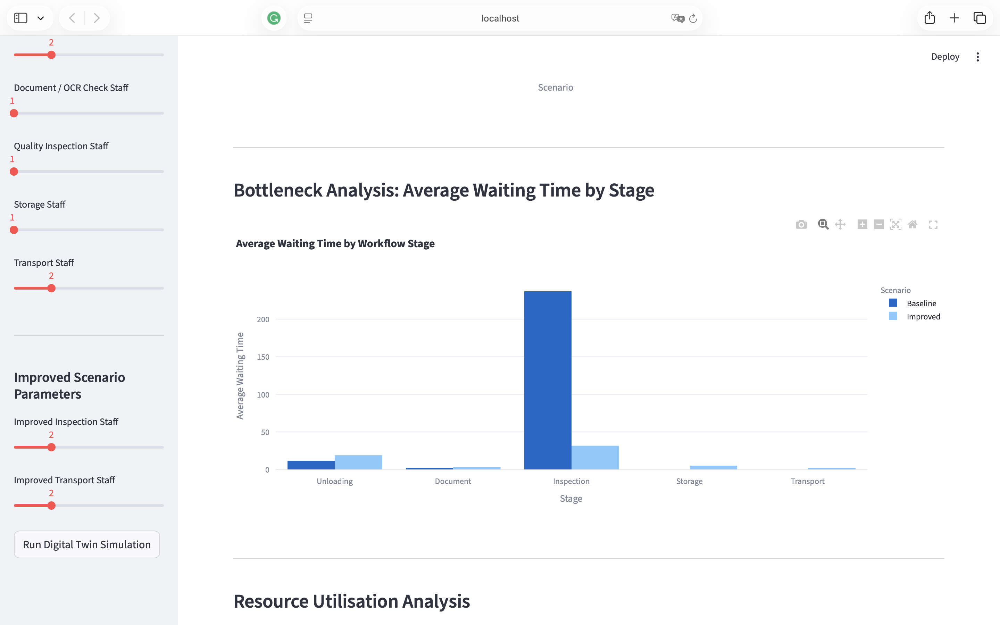
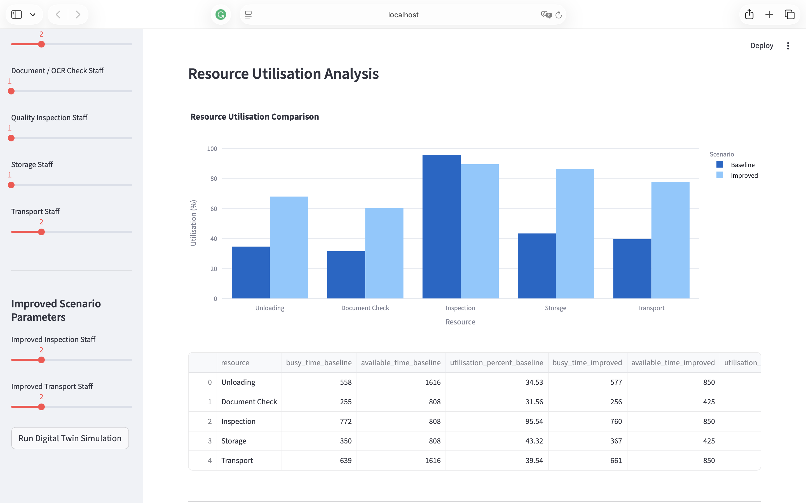
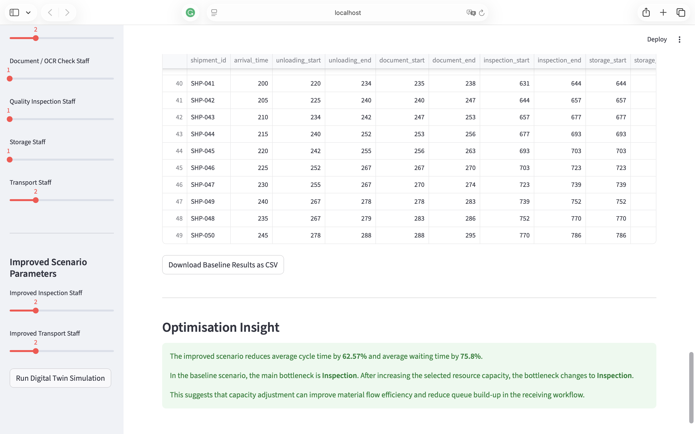

# Warehouse Digital Twin Simulation for Receiving Workflow Optimisation

This project is a Python-based digital twin simulation that models a simplified warehouse receiving, storage, retrieval, and transport workflow. It is designed to analyse bottlenecks, queue time, throughput, resource utilisation, and processing time under different operational scenarios.

The project was developed using **Python, SimPy, Pandas, Streamlit, and Plotly**.

## Live Demo

[Open the Streamlit App](https://warehouse-digital-twin-simulation.streamlit.app/)

---

## Project Objective

Warehouse receiving operations often involve multiple sequential stages, such as unloading, document checking, quality inspection, storage, and transport. Delays in one stage can create queue build-up, increase cycle time, and reduce overall material flow efficiency.

This project aims to simulate the warehouse receiving workflow and evaluate how changes in resource capacity affect operational performance. The simulation helps identify bottlenecks and provides optimisation insights to support warehouse layout and capacity planning decisions.

---

## Digital Twin Concept

This project represents a digital twin because it creates a digital simulation of a physical warehouse workflow.

The model includes:

- A digital representation of warehouse receiving operations
- Discrete-event simulation logic using SimPy
- Adjustable operational parameters
- Scenario-based performance comparison
- Bottleneck and resource utilisation analysis
- Optimisation insights for decision-making

Instead of only displaying static data, the dashboard simulates how materials move through each workflow stage and how operational changes affect overall performance.

---

## Workflow Model

The simulated workflow follows this process:

```text
Supplier Arrival
→ Unloading
→ Document / OCR Check
→ Quality Inspection
→ Storage
→ Retrieval / Transport
→ Completed
```

Each shipment moves through these stages based on resource availability and processing time. If a resource is unavailable, the shipment waits in queue before being processed.

---

## Key Features

- Discrete-event simulation using SimPy
- Interactive Streamlit dashboard
- Baseline vs improved scenario comparison
- Bottleneck detection based on average waiting time
- Resource utilisation analysis
- Throughput and cycle time measurement
- CSV export for simulation results
- Visual workflow status cards
- Optimisation insights for warehouse capacity planning
- Cloud deployment using Streamlit Community Cloud

---

## Tools and Technologies

- Python
- SimPy
- Pandas
- Streamlit
- Plotly
- GitHub
- Streamlit Community Cloud

---

## Simulation Parameters

Users can adjust the following parameters in the dashboard:

- Number of shipments
- Arrival interval
- Unloading staff
- Document / OCR check staff
- Quality inspection staff
- Storage staff
- Transport staff
- Improved inspection staff
- Improved transport staff

---

## Performance Metrics

The dashboard evaluates:

- Completed shipments
- Average cycle time
- Average waiting time
- Throughput per hour
- Bottleneck stage
- Resource utilisation
- Cycle time reduction
- Waiting time reduction
- Throughput increase

---

## Scenario Analysis

The project compares two operational scenarios.

### Baseline Scenario

The baseline scenario represents the current warehouse receiving capacity.

### Improved Scenario

The improved scenario represents an operational improvement, such as increasing inspection or transport capacity.

The dashboard calculates the impact of the improved scenario by comparing:

- Average cycle time
- Average waiting time
- Throughput per hour
- Bottleneck stage
- Resource utilisation

---

## Dashboard Screenshots

### Dashboard Overview



### Digital Twin Workflow Status



### Scenario Comparison



### Bottleneck Analysis



### Resource Utilisation



### Optimisation Insight



---

## Project Structure

```text
warehouse-digital-twin-simulation/
│
├── app.py
├── simulation.py
├── requirements.txt
├── runtime.txt
├── README.md
├── .gitignore
└── screenshots/
    ├── 01_dashboard_overview.png
    ├── 02_workflow_status.png
    ├── 03_scenario_comparison.png
    ├── 04_bottleneck_analysis.png
    ├── 05_resource_utilisation.png
    └── 06_optimisation_insight.png
```

---

## How to Run the Project Locally

Clone the repository:

```bash
git clone https://github.com/vanessarasubala/warehouse-digital-twin-simulation.git
cd warehouse-digital-twin-simulation
```

Create and activate a virtual environment:

```bash
python3 -m venv venv
source venv/bin/activate
```

Install dependencies:

```bash
pip install -r requirements.txt
```

Run the Streamlit app:

```bash
streamlit run app.py
```

If the command does not work, use:

```bash
python -m streamlit run app.py
```

---

## Example Insight

The simulation identifies the workflow stage with the highest average waiting time as the main bottleneck. In the baseline scenario, the bottleneck commonly appears in the quality inspection stage when inspection capacity is limited.

By increasing resource capacity in the improved scenario, the model evaluates whether average waiting time and cycle time can be reduced. This supports data-driven decision-making for warehouse layout, staffing, and capacity planning.

---

## Relevance

This project demonstrates the use of simulation modelling and digital twin concepts to support operational improvement in warehouse and manufacturing environments.

It is relevant to areas such as:

- Smart manufacturing
- Warehouse optimisation
- Supply chain analytics
- Process improvement
- Operations simulation
- Digital transformation
- Capacity planning

---

## Resume Summary

**Warehouse Digital Twin Simulation for Receiving Workflow Optimisation**  
Python, SimPy, Pandas, Streamlit, Plotly

- Built a Python-based digital twin simulation using SimPy to model warehouse receiving, storage, retrieval, and transport workflows.
- Simulated baseline and improved operational scenarios to compare queue time, throughput, resource utilisation, and processing time under different capacity settings.
- Developed and deployed an interactive Streamlit dashboard with bottleneck visualisation, resource utilisation analysis, and optimisation insights to support warehouse layout and capacity planning decisions.